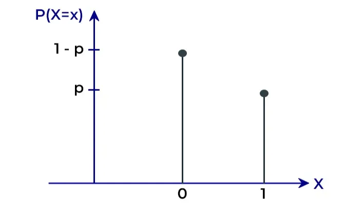
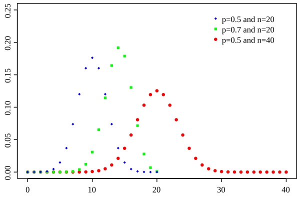
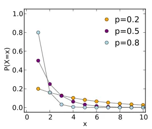
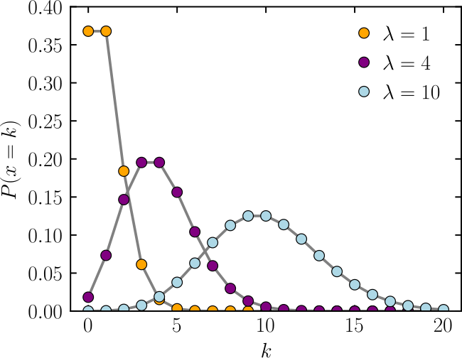
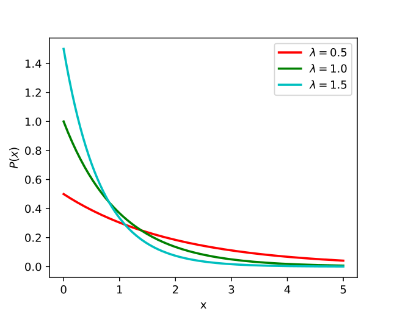
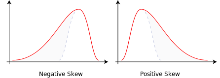

# Probability Distribution and Random Variable

### General Ideas

[(Starting video in the playlist)](https://www.youtube.com/watch?v=Fvi9A_tEmXQ&list=PL1328115D3D8A2566&index=8)

**Probability distribution** function  → Discrete random variable

**Probability density** function → Continuous random variable

### **Bernoulli distribution**

A discrete probability distribution that represents a random variable that takes on one of two possible values (1 and 0), with a probability `p` of being 1 and probability `q` of being 0.

For example, a coin flip can be modeled with a Bernoulli distribution, where heads is 1 and tails is 0

$$
E(X) = p \\
\sigma^{2} = pq = p(1-p)
$$

### **Binomial Distribution**

[(Video)](https://www.youtube.com/watch?v=vKNpQ_KTXvE&list=PL1328115D3D8A2566&index=11)

<aside>
⚡

P(`x` success in `n` trials)

</aside>

Discrete distribution where we count only 2 states represented as 1 (for a success) or 0 (for a failure). Binomial distribution represents the probability for `x` successes in `n` trials, given a success probability `p` for each trial.

For example: If the probability of scoring a goal is 0.3 (p), what is chances of scoring 5 (x) goals in 10 (n) tries

$$
P(X=x) = \mathrm{C}_{x}^{n} \times p^{x} \times (1-p)^{n-x}
$$

$$
E(X) = np \\
\sigma^2=np(1−p)
$$

### Geometric Distribution

<aside>
⚡

P(1st success in `k` trials)

</aside>

A probability distribution that describes the number of trials required to achieve the first success in a sequence of independent and identically distributed Bernoulli trials. It is often used in situations where you repeatedly perform a binary experiment (success or failure) until you achieve the first success.

$$
P(X=k)=(1-p)^{k-1} \times p \\
E(X) = \frac{1}{p} \\
Variance = \frac{1-p}{p^2}
$$

where

- *p* is the probability of success on each trial
- *k* is the number of trials needed to achieve the first success

**Memorylessness Property:**

The probability of achieving the first success in the next trial does not depend on the number of trials already performed

### **Poisson Distribution**

<aside>
⚡

P(`x` success in `n` time or space)

</aside>

A discrete probability distribution which gives the probability of an event happening a certain number of times (k) within a given interval of time or space. The poisson distribution has only one parameter, λ (lambda), which is the mean number of events

We can use a Poisson distribution if:

1. Individual events happen at random and independently. That is, the probability of one event doesn’t affect the probability of another event.
2. We know the mean number of events occurring within a given interval of time or space. This number is called λ (lambda), and it is assumed to be constant

For example: If we know that 10 babies are born on an average in an hour, then we can find the probability of x babies in an hour using poisson distribution

$$
Mean = \lambda \\

Variance = \lambda \\

P(X=x) = \frac{e^{-\lambda}\lambda^{x}}{x!}
$$

### Exponential Distribution

<aside>
⚡

P(`x` time between events in a Poisson process)

</aside>

The exponential distribution is a probability distribution that describes the time between events in a Poisson process, where events occur continuously and independently at a constant average rate.

$$
f(x,\lambda) = \lambda e^{-\lambda x} \\
E(X) = \frac{1}{\lambda}\\
Variance(X) = \frac{1}{\lambda^2}
$$

where *λ* is the rate parameter (also known as the rate of occurrence or the inverse of the mean), and *x* is the random variable representing the time between events.

**Memorylessness Property:** The probability of an event occurring in the next instant is the same, regardless of how much time has already elapsed.

### **Beta Distribution**

Beta distribution is a continuous probability distribution defined on the interval [0,1] in terms of two positive parameters, denoted by *alpha* (*α*) and *beta* (*β*)

- **α (alpha)**: Represents the number of **successes** in a dataset (e.g., heads in coin flips).
- **β (beta)**: Represents the number of **failures** in a dataset (e.g., tails in coin flips).
- A **larger α** results in a distribution skewed toward 1, while a **larger β** skews it toward 0.

$$
E(X) = \frac{\alpha}{\alpha + \beta}
$$

- **Uniform Distribution:** When α=β=1, the Beta distribution reduces to a **Uniform(0,1) distribution**
- **Jeffreys Prior:** When α=β=0.5
- **Uninformative prior:** Beta distribution is used as an uninformative prior when α=β

**Applications**

- **Bayesian Updating:** Beta distribution is the **conjugate prior** for the Bernoulli, Binomial, and Geometric distributions. If a proportion follows a Binomial likelihood, the posterior follows another Beta distribution.
- **A/B Testing:** Beta distributions are used in **Thompson Sampling**, a method for deciding between different treatments in multi-arm bandit experiments.

### **Normal Distribution**

It is related to binomial distribution. Normal distribution is for continuous random variable. If number of tries (n) of a binomial distribution approaches large values, binomial distribution approaches normal distribution

`68-95-99.7 rule`: 1, 2 and 3 standard deviation from mean

$$
P(X) = \frac{1}{\sigma\sqrt{2\pi}} \times exp\left( -\frac{(x-\mu)^{2}}{2\sigma^{2}} \right)
$$

- **Skew**: Degree of asymmetry of the normal distribution
    - Perfectly symmetrical, skew is zero
    - Skewed to the right, skew is positive → Tail towards +ve direction
    - Skewed to the left, skew is negative → Tail towards -ve direction

- **Kurtosis**: Measure of the "peakedness" of a probability distribution
    - Standard normal distribution has a kurtosis of 3
    - Distribution with high kurtosis indicates that it has fatter tails and pointed peaks

- **Z-score**: Z-score is a measure of how many standard deviations an observation is from the mean

$$
z = \frac{X - \mu}{\sigma}
$$

### **Central Limit Theorem**

[(Video)](https://www.youtube.com/watch?v=JNm3M9cqWyc&list=PL1328115D3D8A2566&index=25)

Distribution of sample means of any population distribution (not necessarily normal) is normally distributed

- The mean of the distribution of sample means is same as the mean of the population distribution
- The standard deviation of the sample means will be equal to the population standard deviation divided by the square root of the sample size
- This implies that as sample size increase, the standard deviation reduces
- Standard deviation of the sample means is also called **Standard error of the mean**

### **Chi-square distribution**

([video](https://www.youtube.com/watch?v=dXB3cUGnaxQ&list=PL1328115D3D8A2566&index=61))

Chi-square distribution with k degrees of freedom is the distribution of a sum of the squares of k independent standard normal random variables

- For example, let’s say that $X_1$, $X_2$  and $X_3$ are three random variables which have standard normal distribution i.e $X_1 \sim N(0,1)$ and so on
- Degree of freedom is 1: Random variable Q has chi-square distribution with df=1

$$
Q = X_{1}^2\\
Q \sim \chi^2_{1} 
$$

- Degree of freedom is 2: Random variable Q has chi-square distribution with df=2

$$
Q = X_{1}^2 + X_{2}^2\\
Q \sim \chi^2_{2} 
$$

- Degree of freedom is 3: Random variable Q has chi-square distribution with df=3

$$
Q = X_{1}^2 + X_{2}^2 + X_{3}^2\\
Q \sim \chi^2_{3} 
$$