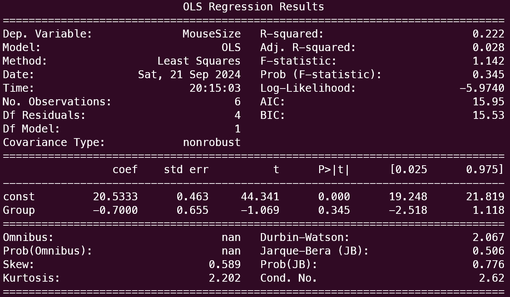

# Statistical Tests

### Parametric and non-parametric tests

1. **Assumptions:** Parametric tests have stricter assumptions about the population distribution, while non-parametric tests are more flexible and make fewer distributional assumptions.
2. **Type of Data:** Parametric tests are often used for interval or ratio data, whereas non-parametric tests can handle a wider range of data types, including ordinal data.
3. **Efficiency:** Parametric tests can be more powerful when assumptions are met, but non-parametric tests are more robust in the presence of violations of assumptions.
4. **Examples:** t-tests and ANOVA are examples of parametric tests, while Mann-Whitney U test and Wilcoxon signed-rank test are examples of non-parametric tests.

### z**-test**

**When to use**: Used to compare means between two groups, means when the population standard deviation is known

**Example (One-Tailed)**: Determine if New Jersey receives significantly more public school funding (per student) than the USA average. You know that the USA mean public school yearly funding is $6300 per student per year, with a standard deviation of $400. Next, suppose you collect a sample (n = 100) and determine that the sample mean for New Jersey (per student per year) is $8801. Use the z-test and the correct Ho and Ha to run a hypothesis test to determine if New Jersey receives significantly more funding for public school education (per student per year).

Ho: mean  funding for New Jersey = mean funding for the USA

Ha: mean funding for New Jersey > mean funding for the USA

The Ho is the null hypothesis and so always contains the equal sign, as it is the case for which there is no significant difference between the two groups

**Types**:

1. One tailed
2. Two tailed

### **t-test**

[(Video1](https://www.youtube.com/watch?v=K4KDLWENXm0&list=PL1328115D3D8A2566&index=35), [Video2)](https://www.youtube.com/watch?v=5ABpqVSx33I&list=PL1328115D3D8A2566&index=38)

**When to use**: Used to compare means between two groups, but if sample size is less than 30. It can also be used when population standard deviation is not known

When the sample size if less than **30**, sample standard deviation is a less accurate measure of population standard deviation. In such cases, we use t-distribution to calculate confidence intervals

**Details:**
t-distribution is similar to normal distribution, but has fatter tails, so would work better for smaller sample sizes. (Note: Below we use t-value for n-1, since n-1 is the degrees of freedom)

$$
Confidence \: Interval = \bar{x} \pm t_{n-1}\frac{s}{\sqrt{n}} \\

where \; \bar{x} := sample \: mean \\ 
and \; s := sample \: stddev \\
and \; t_{n-1} := t-value \\
and \; n := sample \: size
$$

**Types**:

1. One sample t-test
2. Independent two sample t-test: Difference in test scores for 2 different schools
3. Paired t-test: Difference in test scores for a class before and after treatment

Paired T-test has a different formula for t-statistic and involves calculating the difference between each individual sample in the two groups. For example, it would mean finding the difference between pre and post test scores of each student and then taking mean of differences

### Chi-square Test

([Video1](https://www.youtube.com/watch?v=dXB3cUGnaxQ&list=PL1328115D3D8A2566&index=61))

([Video for 2 random variables](https://www.youtube.com/watch?v=hpWdDmgsIRE&list=PL1328115D3D8A2566&index=63))

**When to use**: Used to test the association between two categorical variables

**Example**: Suppose you are conducting a study to investigate whether there is a significant association between gender (male or female) and the preference for a particular type of beverage (Tea, Coffee, or Juice) among a group of individuals.

**Details:**

- It is a non-parametric test, which means that it makes no assumption about the distribution of the random variables
- Used if we want to check if the two random variables are independent of each other or not
    - Null Hypothesis: There is no relationship between the two variables **OR** the observed values and expected values have equal frequencies
    - Alternate Hypothesis: There is a relationship between the two variables
- Degree of freedom
    - df= r-1 when r is row count
    - df= (r-1)(c-1) when r is row count and c is column count

$$
\chi^2 = \sum \frac{(f_e - f_o)^2}{f_e}\\

f_{e} = expected frequencies \\
f_{o} = observed frequencies
$$

**Types**:

1. **Chi-Square Test for Independence**: Tests whether there is a significant association between two categorical variables in a contingency table.
2. **Chi-Square Goodness-of-Fit Test**: Tests whether observed frequencies match expected frequencies for a categorical variable.

### F-test

**When to use**: Used to compare the variance of two groups

$$
F = \frac{Variance of Group1}{Variance of Group 2}
$$

$H_o: \sigma_{1}^2 = \sigma_{2}^2 \\
H_a: \sigma_{1}^2 \neq \sigma_{2}^2$

### ANOVA (F-Test)

([Video](https://www.youtube.com/watch?v=EFdlFoHI_0I&list=PL1328115D3D8A2566&index=64))

**When to use:** Used to compare means among three or more groups. We want to understand if the groups are the same

**Details:**

- Available data:
    - m: Number of groups, i represents $i^{th}$ group
    - n: Number of members in each group, j represents $j^{th}$ member in the group group
    - $\bar{\bar{x}}$: Mean of the entire data
    - $\bar{x_i}$: Mean of $i^{th}$ group
- We define some metrics:
    - SST: Sum of squares total `df = *mn-1*` = $\sum_{i}^{m}\sum_{j}^{n} (x_{ij}-\bar{\bar{x}})^2$
    - SSB: Sum of squared **between** groups `df = *m-1*` = $\sum_{i}^{m}\sum_{j}^{n} (\bar{x_i}-\bar{\bar{x}})^2$
    - SSW: Sum of squares **within** groups `df = *m(n-1)*` = $\sum_{i}^{m}\sum_{j}^{n} (x_{ij}-\bar{x_{i}})^2$
    - SST =  SSB + SSW
- Define hypothesis
    - Null hypothesis: Means of all groups are the same
    - Alternative hypothesis: Means of all groups are not the same

$$
F = \frac{between \space group \space variability}{within \space group \space variability} = \frac{\frac{SSB}{m-1}}{\frac{SSW}{m(n-1)}}
$$

Large F means that the variation in data is mainly due to the differences **between** the groups than within the groups

**Types:**

1. One-Way ANOVA: Compares means of three or more independent groups
2. Two-Way ANOVA: Examines the influence of two different categorical independent variables on a dependent variable.
    
    Example: We are studying effect of 2 types of diets and 2 types of exercise on weight loss.
    
    Ho: No significant diff in weight loss due to variations in diet, exercise, or their interaction
    

1. **Wilcoxon Signed-Rank Test:**
    - **Scenario:** Used when comparing paired samples or when data are not normally distributed.
    - **Note:** Non-parametric alternative to the paired samples t-test.
2. **Mann-Whitney U Test:**
    - **Scenario:** Used to compare two independent samples when data are not normally distributed.
    - **Note:** Non-parametric alternative to the independent samples t-test.
    

### t-test using linear regression

Example: I found out the size of control mice and mutant mice. Now I want to know if there is statistically significant difference between the size of control and mutant mice. I want to use linear regression.

1. First create a binary variable to represent the group

- **0** for the control group
- **1** for the mutant group

2. Secondly fit a Linear Regression Model: The formula for the linear regression would be

$$
mouse\_size = \beta_{0} + \beta_{1}\times Group
$$

1. Perform t-test on $\beta_{1}$. If $\beta_{1}$ is significantly different from 0, then there is a significant difference in mouse size between the mutant and control groups
    1. Alternatively, you calculate R-squared and do F-test to find if the regression explains the variance in data. This method can be generalized to compare any simple model with a complicated model to evaluate the improvement from the complicated model [[video](https://youtu.be/2UYx-qjJGSs)]

Example Using Python's `statsmodels` Library:

```python
import pandas as pd
import statsmodels.api as sm

# Example Data: Mouse Size and Group
data = {'MouseSize': [20.5, 21.0, 20.1, 19.5, 19.0, 21.0], 
        'Group': [0, 0, 0, 1, 1, 1]}  # 0 = Control, 1 = Mutant

df = pd.DataFrame(data)

# Add constant for intercept
X = sm.add_constant(df['Group'])  # Independent variable (Group)
y = df['MouseSize']               # Dependent variable (Mouse Size)

# Fit the linear regression model
model = sm.OLS(y, X).fit()

# View the summary of the regression
print(model.summary())
```



## Binomial test

A statistical test used to determine if the proportion of successes in a sample is significantly different from a hypothesized proportion. It is typically applied when dealing with categorical (binary) data, where each trial results in one of two outcomes (success or failure).

Suppose you flip a coin 20 times and get 15 heads. You want to test whether the coin is biased, with the null hypothesis that the coin is fair (i.e., p0=0.5).

1. **Set up hypotheses**:
    - H0: p=0.5 (the coin is fair).
    - H1: p≠0.5 (the coin is biased).
2. **Choose significance level**: α=0.05
3. **Compute the p-value**: Using the binomial distribution, find the probabilities of observing 15 heads or more extreme results (fewer than 5 heads or more than 15 heads)

$$
P(X \ge 15 \space or \space X\le5) = \sum_{i=0}^{5} {20 \choose i} p^i(1-p)^{20-i} + \sum_{i=15}^{20} {20 \choose i} p^i(1-p)^{20-i}
$$

1. **Decision**: If the p-value is less than 0.05, reject the null hypothesis. If it’s greater than 0.05, fail to reject the null hypothesis.